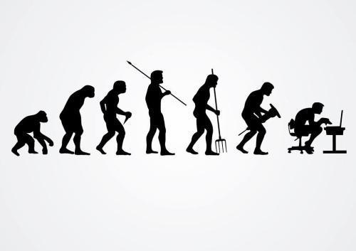
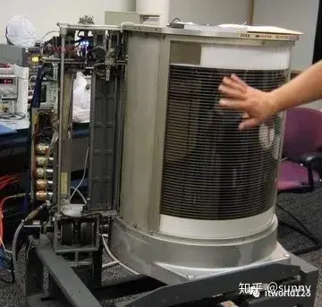
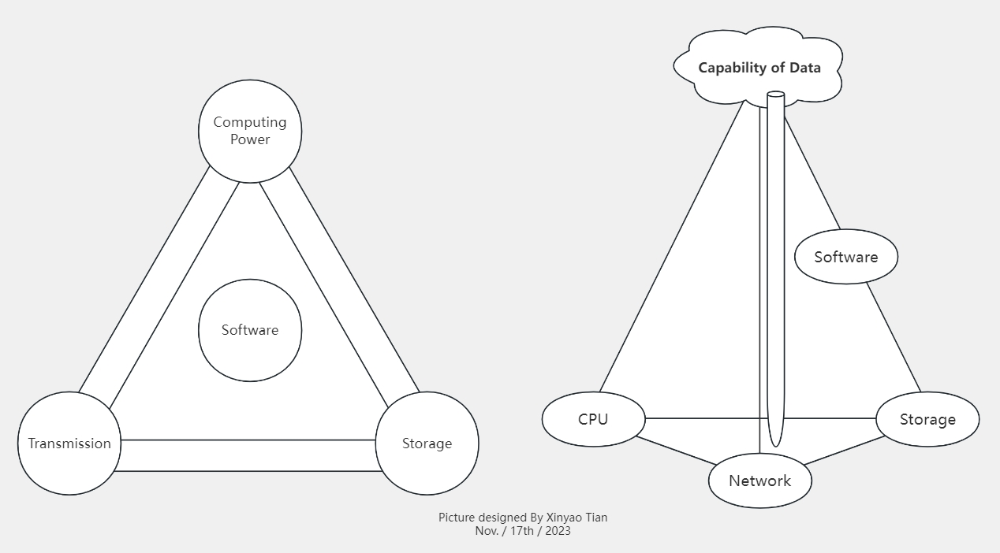
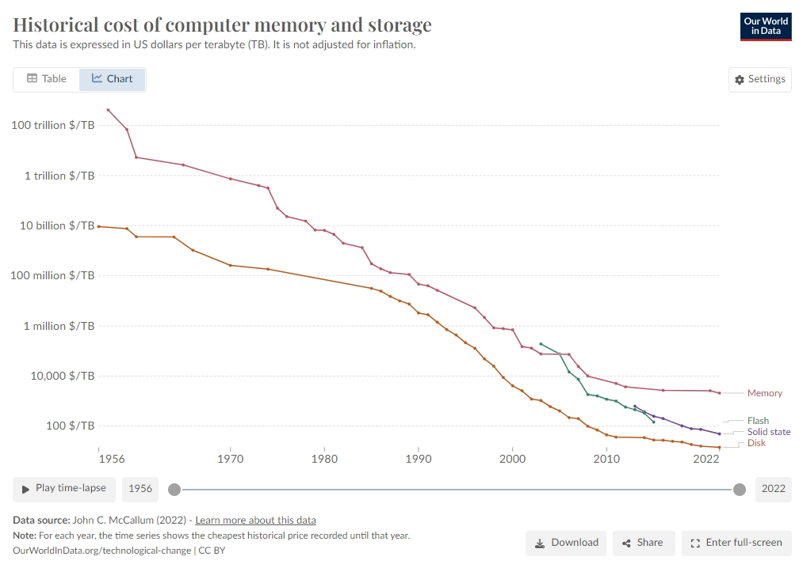
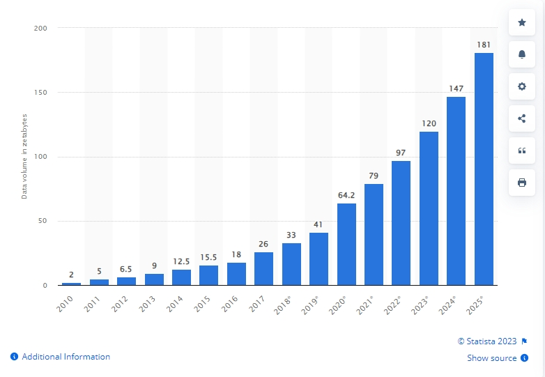
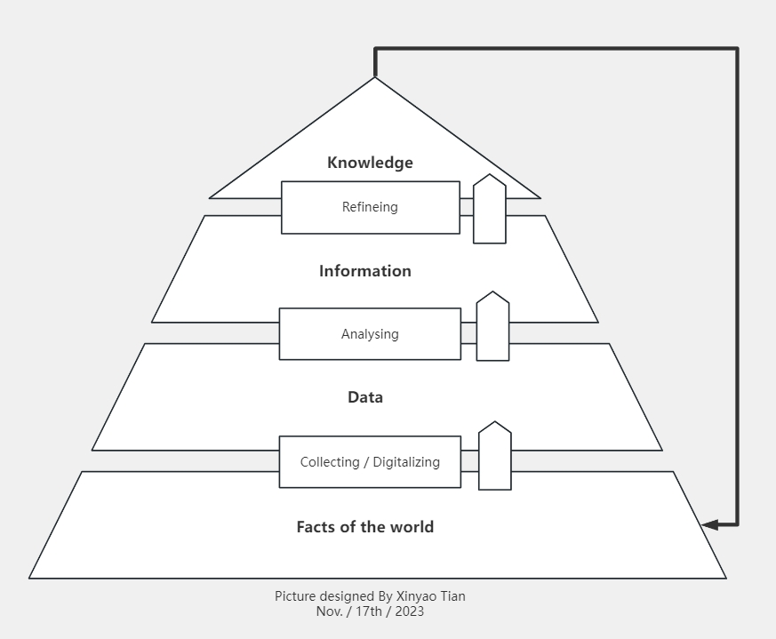
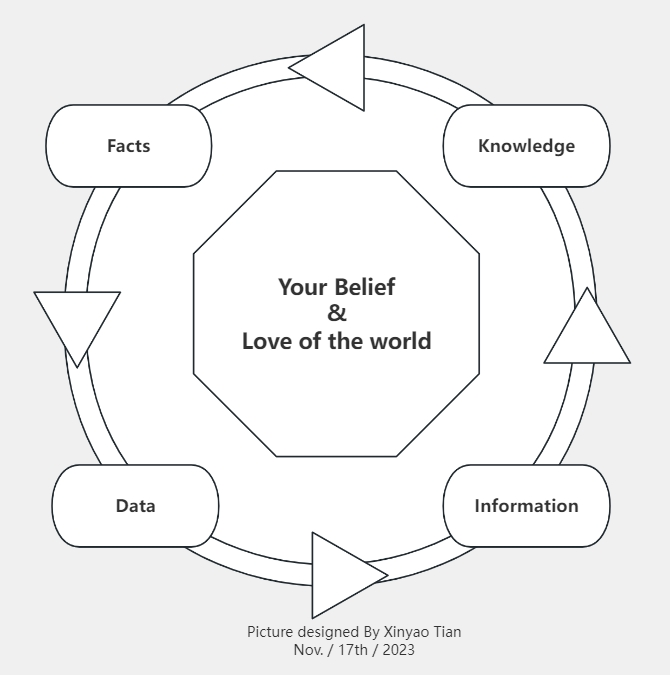

# Tech Talk: It's all about data

## Title 
Data Talk: Say hello to Data :）

## About the authors

- Seminar Coordinator: He Wang ( hewang@ucas.ac.cn )
- Seminar Designer: Xinyao Tian ( xinyao.tian.work@gmail.com )

## Table of Content (内容概览)

Below is the overview of this seminar.

- 数据的起源 (The origin of data)
- 何谓数据？ (What is data?)
- 现代数据技术的发展脉络 (The development momentum behind data)
- 当前主流数据技术 (Modern data technologies)
    - 关系型数据库 (RDBMS)
    - 非关系型数据库 (Not-only SQL (NoSQL) Database)
    - 大数据 (Big Data)
    - 数据仓库 (Data Warehouse)
    - 流式计算 (Stream Processing)
    - 数据湖 (Data Lake)
    - 数据湖仓 (Data Lakehouse)
- 思考：从数据的角度认识世界 (Thinking: Realizing the world from a data perspective)
- 推荐阅读 (Recommend readings)
- Q & A

## The Origin of Data (数据的起源)

数据的历史源远流长，与人类一样古老，甚至比人类更为古老。

The history of data is as old as that of humans, and perhaps even older. Some exemplifications are given below.

### Data produced by human being (人类所产生的数据)

The ancient Chinese used __knots__ for counting. ( _"上古结绳而治" —— 《周易·系辞下》 About ????? BC_)

The __Ishango bone__, discovered at the "Fisherman Settlement" of Ishango in the Democratic Republic of Congo, is a bone tool and possible mathematical device that dates to the Upper Paleolithic era. (_About 19,000 BC_)

### Data produced by non-human (非人类所产生的数据)

早在人类出现之前，数据就已经无处不在。

Data was ubiquitous long before humans existed.

Or, even much longer...

### Human themselves As a kind of data

Human beings, created by someone or something or some phenomenons, definitely can be viewed as one kind of data itself.

__Evolution of Human beings: A kind of data.__

__Human beings: the carriers of data.__

__Human beings themselves: A kind of data.__

> References of this topic:
>
> - [365 DataScience - The History of Data: From Ancient Times to Modern Day](https://365datascience.com/trending/history-of-data/)
> - [香港中国文化研究院 - 古人如何计数?](https://chiculture.org.hk/sc/china-five-thousand-years/2457)
> - [三联生活周刊 - 人类早期的计算方式：结绳计数](https://lifeweek.com.cn/article/130489)

## What exactly is data? (何谓数据？)

Therefore, __what is data?__

### Definition (数据的定义)

The word "data" derives from the Latin word "datum" (singular), which means the “thing given”. (Given By Merriam-Webster Dictionary) 

In morden days, data means "Facts or numbers collected to be examined in an electronic form that can be stored and used by a computer". (Given By Cambridge Dictionary)

> References of this topic:
>
> - [Merriam-Webster Dictionary - Datum](https://www.merriam-webster.com/dictionary/datum)
> - [Cambridge Dictionary](https://dictionary.cambridge.org/dictionary/english/data)

## The development momentum behind data (现代数据技术的发展脉络：计算、存储与传输)

With the help of modern computing technology, data could be used efficient and fast much than ever before.

So, the development of modern data mechanism is the development of modern computing technologies.

### Timeline of the data tech development (数据技术的发展时间轴)

数据技术的发展与计算机技术、网络技术、存储技术和软件技术的发展是高度契合且互为衬托的。

数据技术发展的简要时间轴:

- 【计】1946: ENIAC 美国陆军军械部 (真空管计算机，用于计算导弹射程) 
- 【计】1946 - 1960s: 晶体管计算机 -> 中小规模集成电路 -> 大规模集成电路
- 【存】1956: IBM 305 RAMAC (世界上首个磁盘存储系统，拥有 5M 的超大存储空间，体积超过两个冰箱，存储成本为 7.81 美元/兆，比当时每升油价还贵 38%)
- 【软】Late 1960s: 操作系统 + 高级编程语言 (计算机)
- 【网】1969: 互联网雏形产生 (ARPA Net, 美国国防部研究计划署)
- Late 1960s: Charles W. Bachman designed the frist integrated computer database.
- June 1970: Edgar F. Codd (a computer scientist from IBM) published an academic paper titled, A Relational Model of Data for Large Shared Banks. That paper introduced a new way to model data. (虽然在存储介质中数据是顺序存储的，但 Codd 提出了一种在逻辑上整理数据的方法，即 “表”)
- 1970s: an IBM team led by Donald D. Chamberlin and Raymond F. Boyce frist developed SEQUEL "Structured English Query Language". 后由于版权原因被更名为 SQL (Structed Query Language).
- 1979: 第一批商用数据库在市场上出现 (Oracle, IBM DB2, SAP Sysbase ASE, Informix)，RDBMS 成为主流 (关系型数据库)
- 1980s ~ Early 1990 : 数据库主流技术与功能 Index, Joins, Transactions 先后出现
- 1986: PostgreSQL from UC Berkeley (Open Source)
- 1998: Google Launched
- 2003: Google released white paper on GFS
- 2004: Google released white paper on Map Reduce (存储/计算 分离 ；数据网络的传输)
- February 2005: Google BigTable (NoSQL)
- 2007: Apache Hadoop (Open Source) came out (Originated from Yahoo)
- 2009: Apache Spark from UC Berkeley (内存计算型 MapReduce)
- November 9th, 2011: Apache Hive came out (标志着 Data Warehouse "数据仓库" 趋于成熟并进入开源领域) (Originated from Facebook(now, META))
- January 6th, 2015: Apache Flink luanched (标志着 Realtime Compute "实时计算" 趋于成熟并进入开源领域) (Originated from Technical University of Berlin)
- May 2020: Apache Hudi (originated from Uber) became top-level Apache Project (标志着 Data Lake "数据湖" 趋于成熟并进入开源领域)
- Now (2023): 数据湖仓一体、流批一体、etc.

__首个通用计算机：ENIAC__

ENIAC 的出生得益于二战期间美国对复杂的导弹弹道的计算需求。在研制的过程中，数学家约翰·冯·诺依曼介入，并在这个过程中提出了经典的冯·诺依曼结构，为后世计算机的逻辑结构设计建立了标杆。

起初，ENIAC 只被用于计算一些氢弹相关的数据和炮弹火力表，后来其他许多科研项目也借助了ENIAC的力量，包括天气预报、风洞试验、宇宙射线计算和圆周率计算等项目。

另外，ENIAC 为美国的原子弹研制工作也起到了一定的促进作用，这一事实间接加快了美国把原子弹投向日本的过程，也加快了第二次世界大战及日本全面侵华战争的结束。

__首个磁盘：由 IBM 公司发明的 IBM 305 RAMAC__

> References of this topic
>
> - [Dan Kelly - A brief history of databases](https://www.cockroachlabs.com/blog/history-of-databases-distributed-sql/)
> - [Quickbase - A Timeline of Database History & Database Management](https://www.quickbase.com/articles/timeline-of-database-history)
> - [Agnieszka Kozubek-Krycuń - The History of SQL – How It All Began](https://learnsql.com/blog/history-of-sql/)
> - [W3School - SQL History](https://www.w3schools.in/sql/history)
> - [Chamberlin, Donald D - Early History of SQL](https://ieeexplore.ieee.org/stamp/stamp.jsp?arnumber=6359709)
> - [Data Flair - History of Hadoop "The complete evolution of Hadoop Ecosystem"](https://data-flair.training/blogs/hadoop-history/)
> - [Keith D.Foote - A Brief History of Data Lakes](https://www.dataversity.net/brief-history-data-lakes/#:~:text=Hadoop%20%282008%29%20provided%20the%20search%20engine%20needed%20for,Pentaho%2C%20came%20up%20with%20the%20term%20%E2%80%9CData%20Lake.%E2%80%9D)

### Computing Power, Storage, and Transmission (算力、存储与传输)

“数据存的好、算力算的快、网络传的稳” —— 华为数字发展白皮书

Data has to be:

- stored by a computer -> Storage -> 数据的存储
- passed by a computer -> Transmission -> 数据的传输
- used by a computer -> Computing -> 数据的计算
- (scheduled (integrated) by a computer -> Software(OS & Platform & Applications) -> 数据的调度及使用 (上述三项驱动力被软件 (操作系统、应用软件或平台) 进行统合)) 

> References of this Topic:
> 
> - [华为 - 数据存力，高质量发展的数字基石 白皮书](https://e.huawei.com/topic/data-storage-power-mega/cn/index.html?utm_medium=news&utm_source=hw_official)
> 

### The Relationship Behind

#### Growth of the Driven Forces (数据底层驱动力的发展)

The forces behind the data are growing at an astonishing rate.

- 算力: 摩尔定律 (Moore's Law)

算力增速: 计算能力 (单位价格) 以每 18 个月 100% 的速度增长 (Approximately 60% growing annually)。

算力成本的事实: $3/Byte (1970s) -> $0.00000003/Byte (2023)

> 摩尔定律是由英特尔 (Intel)创始人之一戈登·摩尔 (Gordon Moore)提出来的。 其内容为：当价格不变时，集成电路上可容纳的晶体管数目，约每隔18个月便会增加一倍，性能也将提升一倍。 换言之，每一美元所能买到的电脑性能，将每隔18个月翻两倍以上。

- 存储: 存储容量增长的事实

存储增速: 存储容量 (单位价格) 以每年 175% 的速度增长。

存储成本的事实: $9.20 Billion/TB i.e. $7.81/MB (1956) -> $14.30/TB (2023)

> Capacities of all storage devices grow at the rate of 175 percent annually. This growth can be attributed to the development of storage technology that can fit more data into a smaller amount of physical space, and it is partially driven by the need to accommodate the currently massive and continuously growing amount of data.

- 网络传输: 尼尔森定律 (Nielsen’s Law of Internet bandwidth)

网络传输增速: 网络传输速率 (单位价格) 以每年 50% 的幅度增长 

> Nielsen's law is similar to the more established Moore's law. Unfortunately, comparing the two laws shows that bandwidth grows slower than computer power. Moore's law says that computers double in capabilities every 18 months, which corresponds to about 60% annual growth.

_幽默一刻: 国内网络传输成本可以参考三大电信运营商这三十年的套餐费用改变情况 (另外，如果你发现你的套餐资费变动和 Nielsen 定律不符合，无需奇怪，因为这或许正好可以解释为何某运营商 2022 年的全年净利润超过一千亿元人民币)。_

- 软件: 安迪-比尔定律 (Andy and Bill’s Law)

"Andy gives, Bill takes away."

> 安迪-比尔定理 （Andy and Bill’s Law）是对IT产业中软件和硬件升级换代关系的一个概括。原话是 “Andy gives, Bill takes away.（安迪给多少，比尔拿多少。）” 安迪指英特尔前 CEO 安迪·格鲁夫，比尔指微软前任 CEO 比尔·盖茨，这句话的意思是，硬件提高的性能，很快被软件消耗掉了；不论硬件的性能如何发展，都会被软件吃干抹净，导致硬件的性能相比软件的需求永远处于一个相对不足和紧张的状态。

_幽默一刻: 不论年收入是 3 万元还是 300 亿元，绝大部分人的收入相比于其的理想的生活水平永远处于相对不足的状态，这就是日常生活中的安迪-比尔定律。_

#### Growth of the Human Demand (人类产生数据速度的发展)

根据咨询机构 IDC（Internet Data Center）的整理与分析，人类社会产生的数据一直都在以每年 50% 的速度增长，也就是说，每两年就增加一倍，这被称为 “大数据摩尔定律”。

这意味着，人类在未来两年产生的数据量，相当于自人类诞生之日起直到现在产生的全部数据量之和。在当时， IDC 预测，到 2020 年，全球总共拥有 35 ZB 的数据量，与 2010 年相比，数据量将增长到近 30 倍。(事实上，据不完全统计，截至 2020 年，全世界的数据总量超过 60 ZB ，增速超过 60% 。 1 ZB = 1024 EB = 1024 * 1024 PB)

注: 人类使用电子设备对于现实世界的数字化正在以惊人的速度进行着:

__Possible Reasons：__
- 客观事实与先决条件: 现实世界的 __一个实物__ 对应着电子世界 __无穷种数字化__ 的方式；
- 原动力 (人性): (绝大部分人) 渴望记录被记录，拥有分享的欲望，渴望成为众人的焦点；
- 助推力 (大型机构对于控制社会的野心): Monopolists eager to confirm that everything is recorded and under their control.

#### As a Result... (导致的事实)

支撑数据的各项底层能力的发展速度的差异，加之人们对于数据的需求不断产生变化 (2G -> 3G -> 4G -> 5G -> ...)，使得整个数据领域经常性地（甚至周期性地）新潮涌现，数据相关技术日新月异，数据架构不断改变，最终导致整个领域处于一个永不停息的变化状态（苟日新、日日新、又日新）。

- 例证：人类对于数据需求的不断变化: 2G -> 3G -> 4G -> 5G -> ... (通话 -> 短信 -> 图片 -> 始频 -> ...)

> References of this topic:
>
> - [Intel - Moore’s Law: The past, present and future of Gordon Moore’s golden rule for the semiconductor industry](https://www.intel.com/content/www/us/en/newsroom/resources/moores-law.html)
> - [Brad Kelechava - Increasing Computer Storage to Accommodate Data Growth](https://blog.ansi.org/?p=7225)
> - [Doug Dawson - Nielsen’s Law of Internet Bandwidth](https://circleid.com/posts/20191119_nielsens_law_of_internet_bandwidth/)
> - [Nielsen Norman Group - Nielsen's Law of Internet Bandwidth](https://www.nngroup.com/articles/law-of-bandwidth/)
> - [WikiMili - Andy and Bill's law](https://wikimili.com/en/Andy_and_Bill%27s_law#:~:text=Andy%20and%20Bill%27s%20law%20is%20a%20statement%20that,computing%20conferences%3A%20%22what%20Andy%20giveth%2C%20Bill%20taketh%20away.%22)
> - [Statista - Volume of data/information created, captured, copied, and consumed worldwide from 2010 to 2020, with forecasts from 2021 to 2025](https://www.statista.com/statistics/871513/worldwide-data-created/)
> - [Our World in Data - Historical cost of computer memory and storage](https://ourworldindata.org/grapher/historical-cost-of-computer-memory-and-storage)

## Modern Data Technologies (现代主流数据技术)

### RDBMS (关系型数据库)

A relational database is a type of database that stores and provides access to data points that are related to one another. Relational databases are based on the relational model, an intuitive, straightforward way of representing data in tables.

In a relational database, each row in the table is a record with a unique ID called the key. The columns of the table hold attributes of the data, and each record usually has a value for each attribute, making it easy to establish the relationships among data points.

> References of this topic:
>
> - [Oracle - What is a Relational Database](https://www.oracle.com/database/what-is-a-relational-database/)

### Not-only SQL (NoSQL) Database (NoSQL Database)

a.k.a. Key-value Storage

NoSQL databases (aka "not only SQL") are non-tabular databases and store data differently than relational tables. NoSQL databases come in a variety of types based on their data model. The main types are document, key-value, wide-column, and graph. They provide flexible schemas and scale easily with large amounts of data and high user loads.

> References of this topic:
>
> - [MongoDB - What is NoSQL](https://www.mongodb.com/nosql-explained)

### Big Data (大数据相关技术)

Big data refers to extremely large and diverse collections of structured, unstructured, and semi-structured data that continues to grow exponentially over time. These datasets are so huge and complex in volume, velocity, and variety, that traditional data management systems cannot store, process, and analyze them.

> References of this topic:
>
> - [Google - What is Big Data](https://cloud.google.com/learn/what-is-big-data)

### Data Warehouse (数据仓库)

数据仓库或企业数据仓库 （EDW） 是一种将来自不同源的数据聚合到单个集中式一致数据存储中的系统，以支持数据分析、数据挖掘、人工智能和机器学习。数据仓库系统使组织能够以标准数据库无法做到的方式对大量（TB 和 PB 级别）的历史数据进行强大的分析 (翻译自笔者，定义由 IBM 给出)。

> A data warehouse, or enterprise data warehouse (EDW), is a system that aggregates data from different sources into a single, central, consistent data store to support data analysis, data mining, artificial intelligence (AI), and machine learning. A data warehouse system enables an organization to run powerful analytics on huge volumes (terabytes and petabytes) of historical data in ways that a standard database cannot. (Definition given by IBM)

__Things To Mention:__

- 数据治理 (Data Governance)
- 数据集市 (Data Mart)
- 与大数据相关技术之间的关系

> References of this topic:
>
> - [IBM - What is a data warehouse](https://www.ibm.com/topics/data-warehouse)

### Stream Processing (流式计算)

a.k.a. Real-time Computing

Data Batch Processing vs. Data Stream Processing (Realtime computing) 

Batch processing is a method of running high-volume, repetitive data jobs. The batch method allows users to process data when computing resources are available, and with little or no user interaction. With batch processing, users collect and store data, and then process the data during an event known as a “batch window.”

> References of this topic:
>
> - [AWS - What is Batch Processing](https://aws.amazon.com/cn/what-is/batch-processing/)

A stream is an unbounded sequence of events that go from producers to consumers. A lot of data is produced as a stream of events, for example financial transactions, sensor measurements, or web server logs.

> References of this topic:
>
> - [Nvidia - What Is Stream Processing?](https://www.nvidia.com/en-us/glossary/data-science/stream-processing/)

### Data Lake (数据湖)

数据湖是一个集中式的数据存储，以原始形式摄取和存储大量数据。进入数据湖后，数据便可以被加工处理并被用作各种分析需求的原材料。由于其开放、可扩展的架构，数据湖可以容纳来自任何来源的所有类型的数据，从结构化（数据库表、Excel 工作表）到半结构化（XML 文件、网页）再到非结构化（图像、音频文件、推文），所有这些都不会牺牲保真度 (翻译自笔者，定义由微软给出)。

> A data lake is a centralized repository that ingests and stores large volumes of data in its original form. The data can then be processed and used as a basis for a variety of analytic needs. Due to its open, scalable architecture, a data lake can accommodate all types of data from any source, from structured (database tables, Excel sheets) to semi-structured (XML files, webpages) to unstructured (images, audio files, tweets), all without sacrificing fidelity.

__Things To Mention:__

- Fast Ingestion (快速注入)
- Data Version Control (数据版本控制)
- Transaction Support upon Big Data (大数据环境支持事务)

> References of this topic:
> 
> - [Microsoft - What is a Data Lake?](https://azure.microsoft.com/en-us/resources/cloud-computing-dictionary/what-is-a-data-lake/)

### Data Lakehouse (数据湖仓)

数据湖仓是一个数据平台，它将数据仓库和数据湖的最佳方面合并到一个数据管理解决方案中。数据湖仓寻求解决数据仓库和数据湖的核心挑战，为组织提供更理想的数据管理解决方案 (翻译自笔者，定义由 IBM 给出)。

> A data lakehouse is a data platform, which merges the best aspects of data warehouses and data lakes into one data management solution. Data lakehouses seek to resolve the core challenges across both data warehouses and data lakes to yield a more ideal data management solution for organizations. 

> References of this topic:
> 
> - [IBM - What is a data lakehouse?](https://www.ibm.com/topics/data-lakehouse)

## Data Architecture (数据架构)

### Definition

A data architecture describes how data is managed--from collection through to transformation, distribution, and consumption. It sets the blueprint for data and the way it flows through data storage systems. It is foundational to data processing operations and artificial intelligence (AI) applications. 

> References of this topic:
> 
> - [IBM - What is a data architecture?](https://www.ibm.com/topics/data-architecture)

### Significance

本质：为了满足数据使用方对于数据的需求，综合使用计算机、软件、以及数据技术构建的整体数据技术方案。

__Things To Mention:__

- SLA: Service Level Agreement
- 并非高不可攀，而是为了解决实际问题而发展出来的学科。

## Thinking: Realizing the world from a data perspective (思考：从数据的角度认识世界)

### Facts, Data, Information, and Knowledge (事实、数据、信息、知识之间的关系)

__Pyramid of Data__: The relationship between the four concepts.

### General Methodology from the data aspect (数据领域探索世界的通用方法论)

__Cycle of realizing the world__: use data as tool, your belief&love as core.

## Discussions

- 认识世界的基本方法论的选择: 总结规律 (传统统计学) Or 'Find the nearest point' (大数据技术方法论: 存储+计算) [尼采时代的哲学家们]?
- 应对事情的方式方法: 预测 Or 反应?
- 从数据的角度看待科研与工程: 异曲同工之妙
- 从数据的角度思考物理实验的改进方法 (Inspired By Dr.Wang,He)

## Recommend Readings (推荐阅读)

- 维克托 · 迈尔-施恩伯格《大数据时代》 _浙江人民出版社_
- 吴军 《浪潮之巅》 _人民邮电出版社_
- W.H. Inmon《数据架构》_机械工业出版社_
- 朱尔斯·S·达米吉 等《Spark 快速大数据分析 (第二版)》 _O'Reilly (人民邮电出版社)_
- F. Hueske & V. Kalavri《基于 Apache Flink 的流处理》_O'Reilly (中国电力出版社)_

## Q & A

Questions & Answers

## Acknowledgements (致谢)

Thank you for watching.
