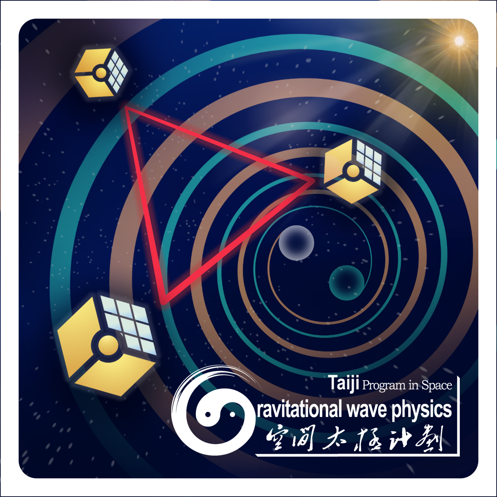
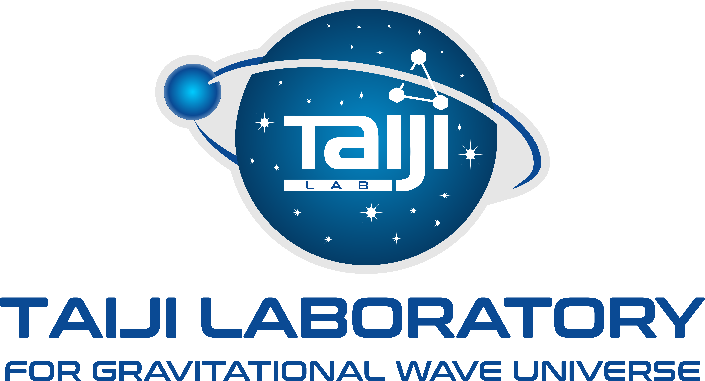

# 引力波数据探索：编程与分析实战训练营
# Gravitational Wave Data Exploration: A Practical Training in Programming and Analysis

> Under construction...

Welcome to the GitHub repository for the Gravitational Wave Data Exploration Bootcamp Series! 
This course is meticulously designed to provide a solid foundation in programming, operational knowledge, and data-driven modeling skills centered around gravitational wave data analysis and research.



## Training Objectives
- Equip participants with robust programming and operational skills, and foundational training in data-driven modeling, focusing on gravitational wave data analysis and related research areas.
- **Note: The course is conducted entirely in Mandarin Chinese to cater to a wide range of Chinese-speaking students and researchers.**
- Discuss the common research methodologies combining gravitational wave data processing with AI technologies, with hands-on examples and projects for practical understanding and mastery.
- Analyze cutting-edge deep learning models and apply them to real-world gravitational wave data analysis problems through specific case studies.

## Target Audience
- Undergraduate and graduate students interested in data analysis and algorithm development, especially those focusing on gravitational wave data processing and related research.
- The course also welcomes undergraduates with a basic programming background, looking to enhance their data analysis skills or with an interest in gravitational wave data processing.
- Future professionals aspiring to work in space-based gravitational wave detection projects and related research fields.

## Course Design Philosophy
- Drawing from past teaching experiences and identified knowledge gaps in student research projects, the course introduces relevant concepts and common methods to ensure comprehensive understanding and application in research.
- The course is scheduled weekly or bi-weekly, each session lasting about 3 hours, combining online and offline methods (腾讯会议) to ensure interactivity and practicality.
- The curriculum is expected to be offered once per semester or annually, with continual updates and enrichment based on student feedback and research demands.

## Course Outline / Schedule
- **Part Zero**: _Motivational Introduction_

    <details>
    <summary>Description</summary>

      - 办课初衷与学员构成
      - 讲师介绍
      - 与本课程相关的知识架构
          - 引力波数据分析
          - 课程大纲
          - 本课程是什么，不是什么
      - 本课程的学习方法与教学团队
      - 本课程的考核规则和项目作业
      - 通向自我实现之路
          - 如何自学
          - 如何提问
      - 提问环节

    </details>

  - Date：[2023/11/08](2023/intro/readme.md) | Video [recording](https://meeting.tencent.com/v2/cloud-record/share?id=a1f3c150-eeb3-4266-a4cc-4099bb28d382&from=3) | Slide: [PDF](2023/intro/slide.pdf) or [online](https://slides.com/iphysresearch/gwda_coding_0)
- **Part One**: _Programming Development Environment and Workflow_
    <details>
    <summary>Description</summary>
  
      - Linux Commands and Shell Scripting
      - Git Version Control (GitHub / GitLab)
      - SSH Remote Server Access (Shell / VSCode)
      - Containerization with Docker
      - Hands-On: Setting up Python / Jupyter Development Environment
      - Hands-On: Compiling LALsuite / LISAcode Source Code

    </details>

  - Date：[2023/11/12](2023/workflow/readme.md#2023-11-12) | Video [recording](https://meeting.tencent.com/v2/cloud-record/share?id=af256140-e032-4b0c-9116-5741fad5010b&from=3) | Slide: [PDF](2023/workflow/slide.pdf) or [online](https://slides.com/iphysresearch/gwda_coding_1)
  - [Homework](2023/workflow/readme.md#homework)
      - Docker Container Setup
      - Remote Development for Python/Jupyter with GPU Support and LALsuite/LISAcode Compilation
  - Date：[2023/11/19](2023/workflow/readme.md#2023-11-19) | Video [recording](https://meeting.tencent.com/v2/cloud-record/share?id=d1e10208-857a-429c-80ee-8a5bfbb88d52&from=3) | Slide: [PDF](2023/workflow/slide_git.pdf) or [online](https://slides.com/iphysresearch/gwda_coding_1_git)
  - [Homework](2023/workflow/readme.md#homework-1)
      - Introduction to Git and GitHub Workflow
      - Setting Up and Submitting Homework via GitHub
- **Tech Talk**: _It's all about data_ (Guest Lecture by [Xinyao Tian](https://www.zhihu.com/people/winchester-26/activities))
    <details>
    <summary>Description</summary>
  
      - 数据的起源 (The origin of data)
      - 何谓数据？ (What is data?)
      - 现代数据技术的发展脉络 (The development momentum behind data)
      - 当前主流数据技术 (Modern data technologies)
        - 关系型数据库 (RDBMS)
        - 非关系型数据库 (Not-only SQL (NoSQL) Database)
        - 大数据 (Big Data)
        - 数据仓库 (Data Warehouse)
        - 流式计算 (Stream Processing)
        - 数据湖 (Data Lake)
        - 数据湖仓 (Data Lakehouse)
      - 思考：从数据的角度认识世界 (Thinking: Realizing the world from a data perspective)
      - 推荐阅读 (Recommend readings)
      - Q & A
  
    </details>

  - Date：[2023/11/19](2023/TechTalk1/readme.md) | Video [recording](https://meeting.tencent.com/v2/cloud-record/share?id=8582150d-9dae-4938-b912-162e6b98bf63&from=3) | Slide: [markdown](2023/TechTalk1/readme.md)
    
- **Part Two**: _Python-Based Data Analysis Fundamentals_
    <details>
    <summary>Description</summary>
  
      - Introduction to Python Programming
      - Algorithms with Numpy / Pandas / Scipy
      - Hands-On: Exploratory Data Analysis of GW Event Catalog / Glitch Data
      - Hands-On: Matched Filtering for GW150914 Data
      - Data Visualization in Python: Theory and Practice
      - Hands-On: Reproducing Figures from GWTC Papers

    </details>

  - Date：[2023/11/29](2023/python/readme.md#2023-11-29) | Video [recording](https://meeting.tencent.com/v2/cloud-record/share?id=38d62612-d754-413f-b6a9-2d0d960f4549&from=3) | Slide: [PDF](2023/python/slide_python.pdf) or [online](https://slides.com/iphysresearch/gwda_coding_2_python)
  - Date：[2023/12/01](2023/python/readme.md#2023-12-01) | Video [recording](https://meeting.tencent.com/v2/cloud-record/share?id=0e5f06cb-8c5b-4e28-a1ba-a766025510e4&from=3) | Slide: [PDF](2023/python/slide_numpy.pdf) or [online](https://slides.com/iphysresearch/gwda_coding_2_numpy)
  - Date：[2023/12/03](2023/python/readme.md#2023-12-03) | Video [recording](https://meeting.tencent.com/v2/cloud-record/share?id=eef300fb-a794-4aff-93e2-0ec36501b1b6&from=3) | Slide: [PDF](2023/python/slide_pandas.pdf) or [online](https://slides.com/iphysresearch/gwda_coding_2_pandas)
  - [Homework](2023/python/readme.md#homework)
      - Python, Numpy, Pandas Basic Homework
      - Leetcode Extension Tasks
  - Date：[2023/12/08](2023/python/readme.md#2023-12-08) | Video [recording](https://meeting.tencent.com/v2/cloud-record/share?id=dd9f5242-b3a8-4500-9436-ba190a739c10&from=3) | Slide: [PDF](2023/python/slide_visualization.pdf) or [online](https://slides.com/iphysresearch/gwda_coding_2_visualization)
  - Date：[2023/12/10](2023/python/readme.md#2023-12-10) | Video [recording](https://pan.baidu.com/s/1MiqCAMGP7-B76uOHCDgErg?pwd=ph8c)
  - [Homework](2023/python/readme.md#homework-1)
      - Data visualization and analysis using Python libraries, matplotlib and seaborn.
  - [Homework](2023/python/4-GWTC3.ipynb)
      - Recreate Figure 7 from the GWTC-3 paper using numpy, pandas, matplotlib, and seaborn.
  - Date：[2023/12/15](2023/python/readme.md#2023-12-15) | Video [recording](https://meeting.tencent.com/v2/cloud-record/share?id=2f4d95c6-424e-400e-b822-2bf3095ab3be&from=3) | [ipynb](./5-GW150914.ipynb) | [html](./5-GW150914.html)
      - LIGO Open Data
      - FFT by scratch
      - Spectral Analysis
      - Data analysis on GW150914
      - Matched filtering to find the signal


- **Part Three**: _Basics of Machine Learning_
    <details>
    <summary>Description</summary>
  
      - Overview of Artificial Intelligence
      - Definitions, Objectives, and Types of Machine Learning
      - Machine Learning Project Development and Preparation
      - Hands-On: Clustering Analysis of LIGO's Glitch Data

    </details>

- **Part Four**: _Introduction to Deep Learning_
    <details>
    <summary>Description</summary>
    
      - Overview of Deep Learning Technologies
      - Fundamentals of Artificial Neural Networks (ANN)
      - Convolutional Neural Networks (CNN)
      - Hands-On: Identifying Gravitational Waves from Binary Black Hole Systems using CNN
      - Frontiers of Gravitational Wave Data Analysis and AI

    </details>


## Getting Started

Welcome to the course project! To get started with your programming assignments, you'll need to set up your workspace. Here's a step-by-step guide to help you through the process.

### Step 1: Set Up Your GitHub Account and Fork the Repository

1. **Create a GitHub Account**: If you don't already have a GitHub account, go to [GitHub](https://github.com/) and sign up.
2. **Fork the Course Repository**:
    - Navigate to the course's GitHub repository: [GWData-Bootcamp](https://github.com/iphysresearch/GWData-Bootcamp).
    - Click on the `Fork` button at the top right of the page.
    - In the fork settings, make sure to **uncheck** the option 'copy `main` branch only'.
3. **Clone the Forked Repository**:
    - Open your terminal or Git Bash.
    - Clone the forked repository to your local machine using the following command:
      ```shell
      git clone git@github.com:<YourGitHubUsername>/GWData-Bootcamp.git
      ```
    - Replace `<YourGitHubUsername>` with your actual GitHub username.

### Step 2: Set Up Your Local Workspace

1. **Switch to the `homework` Branch**:
    - Navigate to your cloned repository's directory:
      ```shell
      cd GWData-Bootcamp
      ```
    - Switch to the `homework` branch using:
      ```shell
      git switch homework
      ```
2. **Create Your Personal Homework Directory**:
    - Inside the `GWData-Bootcamp` directory, create a new directory path for your homework submissions:
      ```shell
      mkdir -p 2023/homework/<YourName>
      ```
      - Replace `<YourName>` with your name or a unique identifier.

### Step 3: Submitting Your Homework

1. **Complete Your Assignments**:
     - Add your completed assignments to your personal homework directory that you created in the previous step.
     - The assignments should be named as `python_submit.txt`, `numpy_submit.txt`, or `pandas_submit.txt` depending on the type of the assignment.
2. **Push Your Changes**:
     - Stage and commit your changes. For example:
       ```shell
       git add .
       git commit -m "Add homework for <SpecificHomework>"
       ```
     - Push your `homework` branch to your forked repository:
       ```shell
       git push origin homework
       ```
3. **Create a Pull Request**:
    - Go to your forked repository on GitHub.
    - Switch to the `homework` branch.
    - Click on New Pull Request.
    - Ensure the base repository is set to the original `GWData-Bootcamp` repository and the base branch is set to `homework`.
    - Complete the PR form and submit.
    - The GitHub Actions workflow will automatically check your submission ([Homework](2023/python/readme.md#homework)) and compare it with the solution. If your submission passes the check, a merge request will be initiated. Please note that only the repository owners have the authority to merge the request.


### Important Notes

- **Do Not Modify Other Students' Work**: It's crucial that you do not make any changes to other students' homework directories and contents.
- **Regular Updates**: Keep your fork synchronized with the main repository to get the latest updates and assignments.
- Automated Checks: The GitHub Actions workflow will automatically check your submission when you create a pull request. Make sure your submission passes the check before you submit it.
- Happy Coding! 🚀👩‍💻👨

## Staff
This class is co-taught by [He Wang](https://iphysresearch.github.io/blog/) and several esteemed colleagues, including guest lecturers and industry experts ([Xinyao Tian](https://www.zhihu.com/people/winchester-26/activities)), whose names will be announced as they join.

## Questions
For any inquiries regarding the course, please email us at [📧 taiji@ucas.ac.cn](mailto:taiji@ucas.ac.cn).

We look forward to your participation and contribution to this exciting field of study!

## Contributing

We welcome contributions to enhance course materials. Please fork the repository, make your changes, and submit a pull request.

## Collaborating Institutions
- [University of Chinese Academy of Sciences](http://english.ucas.ac.cn/) (UCAS)

  

- [International Centre for Theoretical Physics Asia-Pacific](https://ictp-ap.org/) (ICTP-AP)

   
  
- [Taiji Laboratory for Gravitational Wave Universe](https://ictp-ap.org/page/taiji-laboratory)

  

## License

This project is licensed under the MIT License - see the [LICENSE](LICENSE) file for details.

## Acknowledgments

- Contributions from the Gravitational Wave Open Science Center ([gwosc.org](https://gwosc.org/)).
- Educational resources and datasets from renowned institutions and projects in the field.

